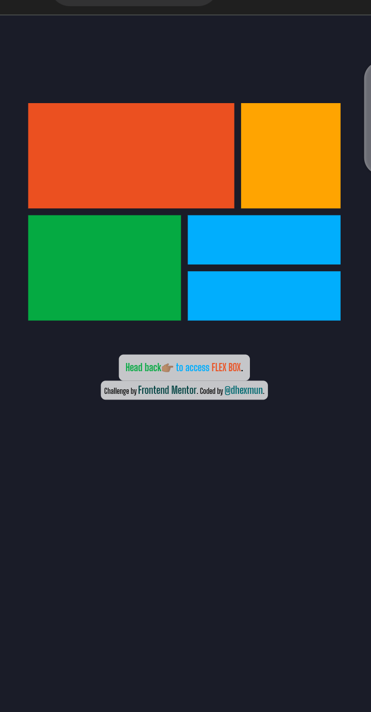

# Frontend Mentor - 3-column preview card component solution

This is a solution to the [3-column preview card component challenge on Frontend Mentor](https://www.frontendmentor.io/challenges/3column-preview-card-component-pH92eAR2-). Frontend Mentor challenges help you improve your coding skills by building realistic projects. 

## Table of contents

- [Overview](#overview)
  - [The Challenge](#the-challenge)
  - [Screenshots](#screenshot)
  - [Links](#links)
- [My Process](#my-process)
  - [Built With](#built-with)
  - [What I Learned](#what-i-learned)
  - [Continued Development](#continued-development)
  - [Useful Resources](#useful-resources)
- [Author](#author)
- [Acknowledgments](#acknowledgments)

## Overview

### The Challenge

Users should be able to:

- View the optimal layout depending on their device's screen size
- See hover states for interactive elements

### Screenshots




### Links

- Solution URL: [Link to solution to the challenge found on frontendmentor](https://www.frontendmentor.io/solutions/responding-landing-page-using-grid-and-flex-box-layout-rydL2Esik-#comment-63552c7d5162212bce6c010b)
- Live Site URL: [My live site hosted on GitHub pages](https://dhexmun.github.io/flex-and-grid-layout/)

## My Process

### Built With

- Semantic HTML5 markup
- CSS custom properties
- Flexbox
- CSS Grid
- Desktop-first workflow
- [Styled Components](https://styled-components.com/) - For styles

**Note: The latter of the above was only an attempt.**

### What I Learned

For a start, I learnt how to create a good Flexbox and Grid Layout. While in addition to that, I got to play around some CSS custom properties and tried to successfully understand it's inner workings, also learnt to an extent some proper ways of writing a complete and presentable README file like this one you're reading.
Some code samples of areas I did fancy while coding this and would like to highlight are seen below:

```html
<div class="attribution">
    Challenge by <a class="devs" href="https://www.frontendmentor.io?ref=challenge" target="_blank">Frontend Mentor</a>. 
    Coded by <a class="dev" href="https://twitter.com/dhexmun4Christ">@dhexmun</a>.
      </div>
```
....because it displayed even without a <p>, I hoped not initially.

```css
.grid-container {
   display: grid;
   grid-template-areas: 
      "a a a a b b"
      "a a a a b b"
      "c c c d d d"
      "c c c e e e"
   ;
   grid-gap: 10px;
}
```
....this further tells me there's alot yet unknown, even in CSS.

### Continued Development

Like I stated earlier, there's alot still to be learnt, something I'm glading looking forward to. During the course of this challenge, I came to an understanding that there are other ways/method one could adopt for the layouts especially when doing something enormous and I intend to explore, refine and perfect all there is to be amongst the best in the webspace.

### Useful Resources

- [Example of Flexbox Layout](https://www.youtube.com/watch?v=WUBnyr-9tug&list=PLxuUHF3OiqfWVlH5BTGUA9OboRF13Zyaj&index=12&t=16s) - This ZuriTeam video recording on introduction to flexbox layout helped me a mile, the methods adopted seem quiet explanatory enough for me.
- [Example of Grid Layout](https://www.youtube.com/watch?v=Ly8rHvRQBy0&t=170s) - This is another nice video which helped me finally understand the basics of Grid Layout, a method I ended up adopting. I'd recommend it to anyone still learning this concept.

## Author

- Website - [dhexmun](https://www.twitter.com/dhexmun4Christ)
- Frontend Mentor - [@dhexmun](https://www.frontendmentor.io/profile/dhexmun)
- Twitter - [@dhexmun4Christ](https://www.twitter.com/dhexmun4Christ)

**Note: Portfolio website still in the works.**

## Acknowledgments

Many thanks to the ZuriTeam Training (which I also belong to (as at the time of coding this), that spurred me on in completing this challenge and also added the grid-layout task for me to hone my flex Box and Grid Layout skills as well as showcase them.

**It's been a wonderful👨🏽‍💻 experience so far, though daunting at this time but wonderful😊 nonetheless.**
